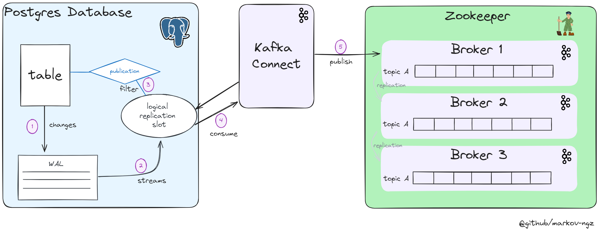

# postgres-cdc
Repository dedicated to the exploitation of the  postgres write ahead logging (WAL) in order to capture data change ( CDC). <br>
Please note that the settings are not for production or testing. 

<h3>System schema </h3>



## Setup 
### 1. Environment 
0. [Optionnal] Install python dependencies 
1. Fill the values of the ```.env``` file.
2. Change the name contained in <> in the ```database_setup.sql```
### 2. Kafka Connector
3. Run the containers ```docker-compose up -d```
3. Run the operations contained in ```database_setup.sql```.  
4. Restart the database container
5. Deploy the connector by running ```python scripts/deploy_connector.py```
6. Check connector status with ```python scripts/check.py```
### 3. Run 
7. Simulate traffic : ```python scripts/simulate_traffic.py```
8. Check the logs or the content of the topic 

## Troubleshooting commands 
- Brokers :
```
# Create a topic  
./bin/kafka-topics.sh --create --bootstrap-server zookeeper:9092 --topic <topic_name> --replication-factor 3

# Describe topic 
./bin/kafka-topics.sh --describe --bootstrap-server broker1:9092 --topic <topic_name>

# Product into a topic 
./bin/kafka-console-producer.sh --topic <topic_name> --bootstrap-server broker1:9092

# Consum into a topic 
./bin/kafka-console-consumer.sh  --topic <topic_name> --bootstrap-server broker1:9092 --consumer-property group.id=<group_name>

# List consumer group state
./bin/kafka-consumer-groups.sh --bootstrap-server broker1:9092 --group <group_name> --describe
```
- Zookeeper : 
```
# Connect to cluster 
./bin/zkCli.sh -server zookeeper:2181

# Get brokers's id
ls brokers/id

# Get topics 
ls /brokers/topics

# Get broker's status 
get /brokers/ids/<id>

# Notes : the same can be done from within a broker 
./bin/zookeeper-shell.sh zookeeper:2181 ls /brokers/ids 
```

<h3>Useful links</h3>  
- <b>debezium</b> : https://debezium.io/documentation/reference/stable/connectors/postgresql.html  <br>
- <b>postgres wal configuration </b> : https://www.postgresql.org/docs/12/runtime-config-wal.html